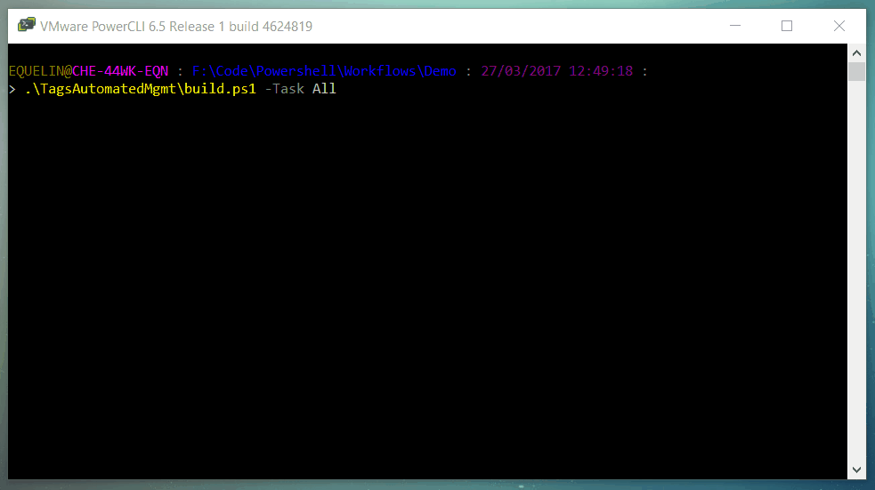

# vmware-powercli-workflows

This repository purpose is to gather multiple scripts to help automating VMware vSphere infrastructures management. 

Most of the automation is build around VMware Tags. For example VMs could be added or removed from DRS groups depending of its tag. The same goes for SPBM management.



Each sub folder is an independant script. All of them are designed with the same pattern that has been inspired by Brandon Olin (@devblackops) blog post https://devblackops.io/building-a-simple-release-pipeline-in-powershell-using-psake-pester-and-psdeploy/.

# Requirements

- Powershell (tested with version 5)
- Powercli (tested with version 6.5) 
- Powershell modules Pester, PSake and PSScriptAnalyzer

# How to use the scripts

1. Download the repository from GitHub
2. [Unblock the archive](https://dmitrysotnikov.wordpress.com/2010/12/30/unblocking-powergui-add-ons-and-powershell-modules/)
3. Extract the archive wherever you want
4. In each sub folder:
   1. Modify .\Configs\Config.ps1 according to your infrastructure
   2. If needed, modify .\Data\*.csv files
   3. Run the script

```Powershell
# prechecks tests only
> .\TagsAutomatedMgmt\Build.ps1

# run the full script
> .\TagsAutomatedMgmt\Build.ps1 -Task All
```

# Scripts purposes and requirements

## TagsAutomatedMgmt

### Purpose

This script will manage VM's tags affectation from a CSV file. It's useful when some mandatory tags has to be assign to VMs.
The CSV file is the source of truth for those specifics tags. Any manual modification of this tags will be overwritten by the script.

### Configuration files

Before using this script, you will need to modify those files:
- .\Configs\Config.ps1
- .\Data\Tags.csv

### Requirements

- Categories have to be created before running the script
- All VM needs to be listed in the CSV file otherwise precheck test will throw an error.

## DRSGroupsAutomatedMgmt

### Purpose

This script will manage DRS VM's groups. VMs are added or removed depending on the tags associated to it.

### Configuration files

Before using this script, you will need to modify those files:
- .\Configs\Config.ps1

### Requirements

- Categories have to be created before running the script
- DRS VM groups have to be created before running the script.

### Known limitations

- VM Groups should contains at least two VMs otherwise the script will throw an error if it has to removed a VM from a group with only one VM.

## SPBMFromTag

### Purpose

This script will manage Storage Policy affectation to VMs based on tags. The script will compare tags assign to the VM with tags used in SPBM rule-sets. 

### Configuration files

Before using this script, you will need to modify those files:
- .\Configs\Config.ps1

### Requirements

- SPBM should have been created first before running the script.

### Known limitations

- VM Groups should contains at least to VMs otherwise the script will throw an error if it has to removed a VM from a group with only one VM.

## MoveVMToCompliantDS

### Purpose

This script will invoke a Storage vMotion to move VMs to a complaiant datastore.

### Configuration files

Before using this script, you will need to modify those files:
- .\Configs\Config.ps1

### Requirements

- SPBM should have been created first before running the script.

### Known limitations

- VM Groups should contains at least to VMs otherwise the script will throw an error if it has to removed a VM from a group with only one VM.

# Author

**Erwan Quélin**
- <https://github.com/equelin>
- <https://twitter.com/erwanquelin>